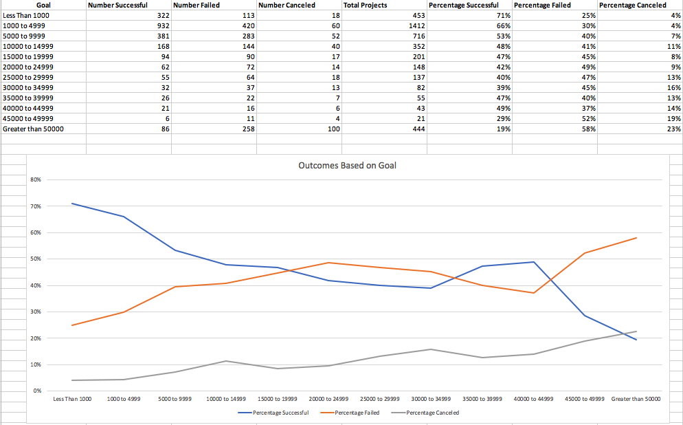

# Unit 1 Homework: Kickstart My Chart

## Background

Over $2 billion has been raised using the massively successful crowdfunding service, Kickstarter, but not every project has found success. Of the more than 300,000 projects launched on Kickstarter, only a third have made it through the funding process with a positive outcome.

Getting funded on Kickstarter requires meeting or exceeding the project's initial goal, so many organizations spend months looking through past projects in an attempt to discover some trick for finding success. For this week's homework, you will organize and analyze a database of 4,000 past projects in order to uncover any hidden trends.

## Instructions

Using the Excel table provided, modify and analyze the data of 4,000 past Kickstarter projects as you attempt to uncover some market trends.

* Use conditional formatting to fill each cell in the `state` column with a different color, depending on whether the associated campaign was successful, failed, or canceled, or is currently live.

  * Create a new column O called `Percent Funded` that uses a formula to uncover how much money a campaign made to reach its initial goal.

* Use conditional formatting to fill each cell in the `Percent Funded` column using a three-color scale. The scale should start at 0 and be a dark shade of red, transitioning to green at 100, and blue at 200.

  * Create a new column P called `Average Donation` that uses a formula to uncover how much each backer for the project paid on average.

  * Create two new columns, one called `Category` at Q and another called `Sub-Category` at R, which use formulas to split the `Category and Sub-Category` column into two parts.

  

  * Create a new sheet with a pivot table that will analyze your initial worksheet to count how many campaigns were successful, failed, canceled, or are currently live per **category**.

  * Create a stacked column pivot chart that can be filtered by country based on the table you have created.

  

  * Create a new sheet with a pivot table that will analyze your initial sheet to count how many campaigns were successful, failed, or canceled, or are currently live per **sub-category**.

  * Create a stacked column pivot chart that can be filtered by country and parent-category based on the table you have created.

* The dates stored within the `deadline` and `launched_at` columns use Unix timestamps. Fortunately for us, [there is a formula](http://spreadsheetpage.com/index.php/tip/converting_unix_timestamps/) that can be used to convert these timestamps to a normal date.

  * Create a new column named `Date Created Conversion` that will use [this formula](http://spreadsheetpage.com/index.php/tip/converting_unix_timestamps/) to convert the data contained within `launched_at` into Excel's date format.

  * Create a new column named `Date Ended Conversion` that will use [this formula](http://spreadsheetpage.com/index.php/tip/converting_unix_timestamps/) to convert the data contained within `deadline` into Excel's date format.

  

  * Create a new sheet with a pivot table with a column of `state`, rows of `Date Created Conversion`, values based on the count of `state`, and filters based on `parent category` and `Years`.

  * Now create a pivot chart line graph that visualizes this new table.

* Create a report in Microsoft Word and answer the following questions.

1. Given the provided data, what are three conclusions we can draw about Kickstarter campaigns?
2. What are some limitations of this dataset?
3. What are some other possible tables and/or graphs that we could create?

## Bonus

* Create a new sheet with 8 columns:

  * `Goal`
  * `Number Successful`
  * `Number Failed`
  * `Number Canceled`
  * `Total Projects`
  * `Percentage Successful`
  * `Percentage Failed`
  * `Percentage Canceled`

* In the `Goal` column, create 12 rows with the following headers:

  * Less than 1000
  * 1000 to 4999
  * 5000 to 9999
  * 10000 to 14999
  * 15000 to 19999
  * 20000 to 24999
  * 25000 to 29999
  * 30000 to 34999
  * 35000 to 39999
  * 40000 to 44999
  * 45000 to 49999
  * Greater than or equal to 50000

  

* Using the `COUNTIFS()` formula, count how many successful, failed, and canceled projects were created with goals within the ranges listed above. Populate the `Number Successful`, `Number Failed`, and `Number Canceled` columns with this data.

* Add up each of the values in the `Number Successful`, `Number Failed`, and `Number Canceled` columns to populate the `Total Projects` column. Then, using a mathematical formula, find the percentage of projects that were successful, failed, or canceled per goal range.

* Create a line chart that graphs the relationship between a goal's amount and its chances at success, failure, or cancellation.

## Submission

* To submit your homework, upload the solution and files to a GitHub repo, Dropbox, or Google Drive and submit the link to <https://bootcampspot.com/>.

- - -

© 2019 Trilogy Education Services
