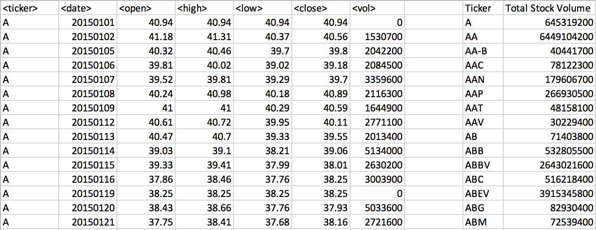
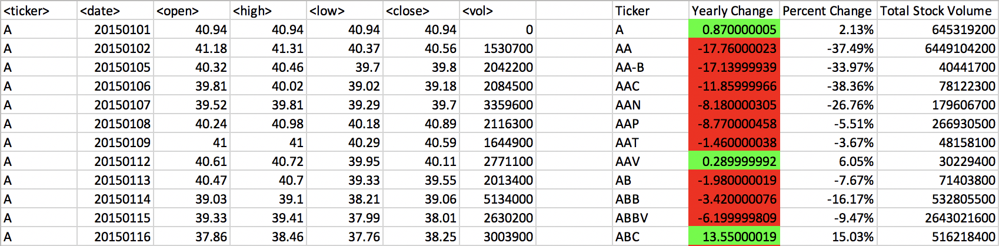
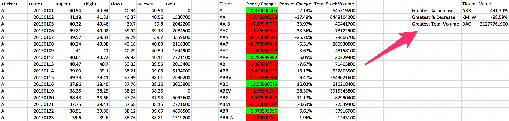

# Unit 2 | Assignment - The VBA of Wall Street

## Background

You are well on your way to becoming a programmer and Excel master! In this homework assignment you will use VBA scripting to analyze real stock market data. Depending on your comfort level with VBA, choose your assignment from Easy, Moderate, or Hard below.

### Files

* [Test Data](Resources/alphabtical_testing.xlsx) - Use this while developing your scripts.

* [Stock Data](Resources/Multiple_year_stock_data.xlsx) - Run your scripts on this data to generate the final homework report.

### Stock market analyst

### Easy

* Create a script that will loop through one year of stock data for each run and return the total volume each stock had over that year.

* You will also need to display the ticker symbol to coincide with the total stock volume.

* Your result should look as follows (note: all solution images are for 2015 data).

### Moderate

* Create a script that will loop through all the stocks for one year for each run and take the following information.

  * The ticker symbol.

  * Yearly change from opening price at the beginning of a given year to the closing price at the end of that year.

  * The percent change from opening price at the beginning of a given year to the closing price at the end of that year.

  * The total stock volume of the stock.

* You should also have conditional formatting that will highlight positive change in green and negative change in red.

* The result should look as follows.

### Hard

* Your solution will include everything from the moderate challenge.

* Your solution will also be able to return the stock with the "Greatest % increase", "Greatest % Decrease" and "Greatest total volume".

* Solution will look as follows.

### CHALLENGE

* Make the appropriate adjustments to your script that will allow it to run on every worksheet, i.e., every year, just by running it once.

* This can be applied to any of the difficulties.

### Other Considerations

* Use the sheet `alphabetical_testing.xlsx` while developing your code. This data set is smaller and will allow you to test faster. Your code should run on this file in less than 3-5 minutes.

* Make sure that the script acts the same on each sheet. The joy of VBA is to take the tediousness out of repetitive task and run over and over again with a click of the button.

## Submission

* To submit please upload the following to Github:

  * A screen shot for each year of your results on the Multi Year Stock Data.

  * VBA Scripts as separate files.

* After everything has been saved, create a sharable link and submit that to <https://bootcampspot-v2.com/>.

- - -

### Copyright

Coding Boot Camp © 2019. All Rights Reserved.
