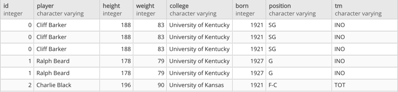

## Joining the NBA

In this activity, you will be using joins to query NBA player seasonal statistics.

### Instructions

1. Create a new database named `NBA_DB` and create two new tables with pgAdmin named `players` and `seasons_stats`.

2. Copy the code from `schema.sql`  to create the tables, and then import the corresponding data from `Players.csv` and `Seasons_Stats.csv`. **Note:** Remember to refresh the database; newly created tables will not immediately appear.

3. Perform joins that will generate the following outputs:

Basic Information Table:

  Percent Stats:

