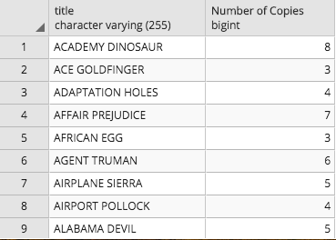

## A View with a Roomful of Queries

In this activity, you will work with a partner to practice your join and subquery skills, as well as build out a view.

### Instructions

- Write a query to get the number of copies of a film title that exist in the inventory. The results should look like those shown in the following image. Your challenge is to use a subquery (a query embedded within another query) instead of a join.

  

- Create a view named `title_count` from the above query.

- Query the newly created view to find all the titles that have 7 copies.
