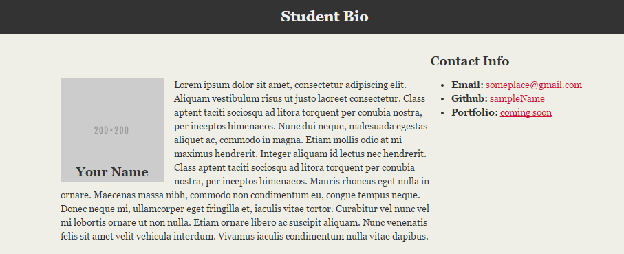

# Student Bio With Style

## Instructions

* Open the [Unsolved](Unsolved) folder and use the files inside as a starting point. Share  with the students to show what the layout should resemble after applying CSS styling.

* Style the HTML file with the following:

  * Add a `class` called "container" on the `div` tag.
  * Add an `id` called "main-bio" for the first `section` tag.
  * Add an `id` called "contact-info" for the second `section` tag.
  * Add an `id` called "bio-image" for the bio image.
  * Style specs:
    * `body`
      * The background color is `#efeee7`.
      * The font used `"Georgia", Times New Roman, Times, serif;`.
      * The font color is `#333333`.
      * Be sure to zero out the body margins and padding so the page is flush to the top of the page.
    * `header`
      * The background-color is `#333333`.
    * `h1`
      * The font color is `#eee`.
      * The font size is `28px`.
      * Look at the example on the screen, and eyeball the padding and/or margins and positioning of the text.
    * `h2`
      * The font size is `24px`
    * Make the container have a width of 1024 pixels, and center it. You do this using `margin: 0 auto;`.
    * Make `#main-bio`, `#contact-info`, `#bio-image` all `float: left`.
    * Make the `#bio-image` have a width of 200 pixels.
    * Be sure to include `alt` text in all images
    * `#main-bio` should have a width of `70%`.
    * Add margins to the image so there is distance between it and the bio text.
    * `#content-info` should have a width of `30%`.
      * Adjust the line height so it is 1.5 times the size of the font.
    * Make the link color `#d21034`.
    * `#figure` should be given relative positioning
    * `#bio-name` should use absolute positioning and be placed at the bottom-center of your `#bio-image`

* Make sure to replace the content inside of the HTML document with your own name, github link, etc.

* Stage, commit, and push this new file to GitHub Pages

### Bonuses

* Using fixed positioning, attempt to create a footer on your page that will stay positioned at the bottom of the screen even when scrolling.

* Underneath the main content of your page, add in a "portfolio" section. Try to make it so that the projects are set up in a kind of grid with two projects per row. Each of the projects should be named with a header, include a relevant image, and have a short paragraph describing the project.
