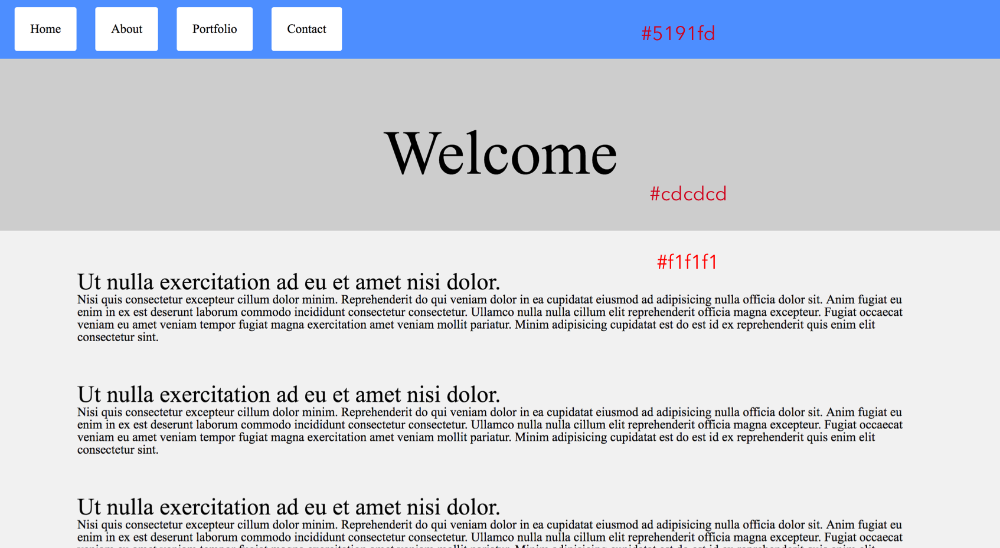

# CSS Review

* In this activity we will review CSS by attempting to recreate a web page.

## Instructions

* Open the [Unsolved Folder](Unsolved). For this activity, you are adding CSS styles to the `index.html` file in this folder.

* Take a moment to study the [`01-CSS-Review.png`](Images/01-CSS-Review.png) image. The provided HTML file has all of the required elements included to create the web page described, but none of the CSS.

  

* Add styles to the `styles.css` file to make `index.html` look like the web page in `01-CSS-Review.png`.

* Try to get your styles as close to the image as possible.
