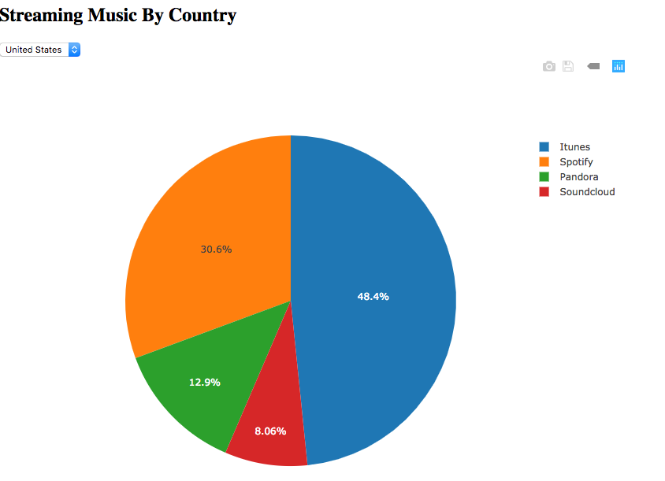

# A Musical Pie

In this activity, you will create a dynamic pie chart using Plotly.

## Instructions

Using the data in `data.js`, create a pie chart that meets the following criteria:

* Displays a default dataset. 

* Contains a dropdown menu listing 3 countries: United States, United Kingdom, and Canada. 

* When the dropdown menu selection changes, the chart should be restyled to reflect the new data.

See the following image for reference. 

---

 © 2019 Trilogy Education Services 