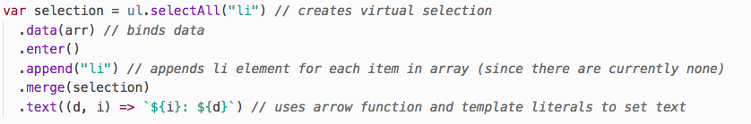
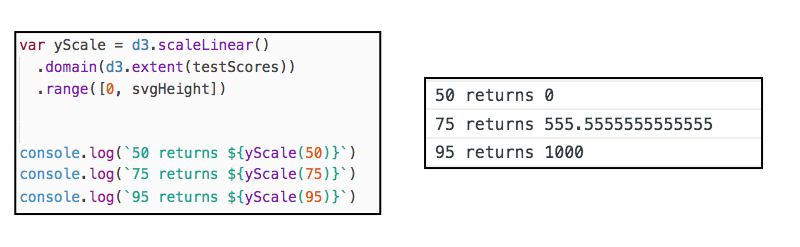
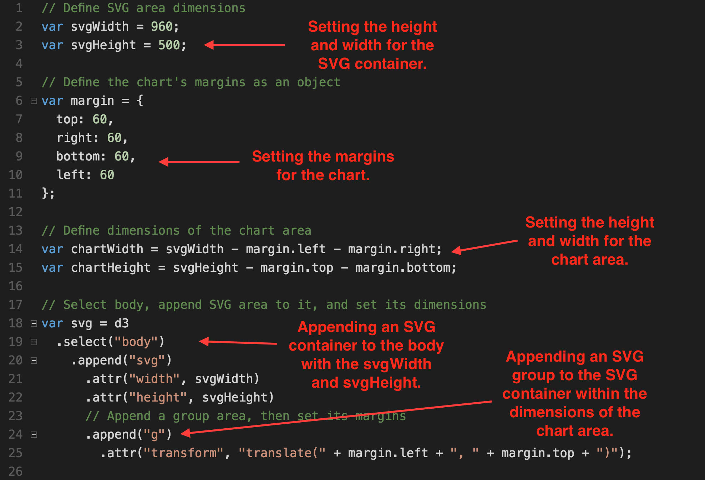
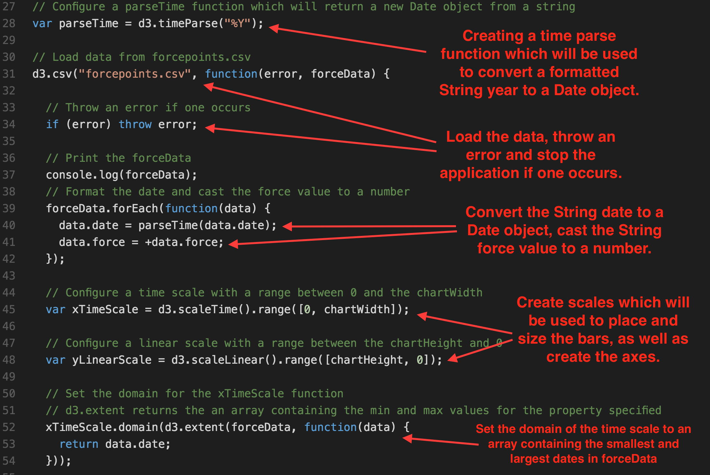

## 16.2 Lesson Plan - Bar and Line Charts with D3

### Overview

In today's class students will expand upon their knowledge of D3 from the previous class to create various types of charts and graphs.

##### Instructor Priorities

* Students should become more comfortable with data-binding with D3.

* Students should be able to import data sets from CSV files.

* Students should understand how to make a chart responsive on all screen sizes.

##### Instructor Notes

* This lesson includes a good amount of instructor-led demonstrations, so it's advisable to spend some time going through the activities before class.

* Please reference our [Student FAQ](../../../05-Instructor-Resources/README.md#unit-16-d3) for answers to questions frequently asked by students of this program. If you have any recommendations for additional questions, feel free to log an issue or a pull request with your desired additions.

### Sample Class Video (Highly Recommended)

* To view an example class lecture visit (Note video may not reflect latest lesson plan): [Class Video](https://codingbootcamp.hosted.panopto.com/Panopto/Pages/Viewer.aspx?id=8b41bbbd-06c2-443e-bb33-a88000086940)

- - -

### Class Objectives

* Students will deepen their knowledge of the D3 library.

* Students will create different types of charts and graphs using D3.

* Students will cover creating scales and axes in D3.

- - -

### 1. Instructor Do: Welcome Class (0:05)

* Welcome the class back. Today they will build on the skills they've learned during last class to create a variety of interactive charts using D3.

### 2. Partners Do: Review D3 (0:10)

* Slack out [questions.js](Activities/01-Par_Review_D3/Unsolved/questions.js) to students.  Have them them work in pairs to discuss and answer the questions.

### 3. Instructor Do: Review D3 (0:10)

* After giving student some time to discuss the solutions, open the [solution file](Activities/01-Par_Review_D3/Solved/questions.js) for reference, go over the answers to the review, and live code the appropriate questions.  Don't worry too much if students haven't completed all the review exercises, they will get plenty of practice in this lesson.

* What is an SVG?  How are they used with D3?

  * Scalable Vector Graphics

  * SVG files allow us to define our own graphics like shapes and lines.  This gives us flexibility to build our custom charts.

* What is data binding?

  * Binds an array of data to elements currently on the page or to be rendered to the page.  In other words, data binding matches data with html elements.

* Go over the code for numbers 3 and 4, and the Bonus with the students.

  * In part 3, Make sure to stress the creating of a virtual selection, and then `enter().append()` pattern.

    

  * In part 4, note that the starter code changes slightly because of the assumption that elements are already on the page.  Highlight the use of `merge(selection)` to include both new and old elements in the selection object.

    

  * In the bonus, change the callback function in the `text()` function to be an arrow function that utilizes template literals to make our code concise.  Note `(d,i)` are positional arguments that give us access to the data and index.  You may also want to highlight that since we are only returning a string in the function, the return statement is not needed.

    

### 4. Instructor Do:  Loading Data (0:10)

* This activity demonstrates how to use `d3.csv()` to parse a CSV file.

* Show the file structure in [02-Ins_Loading_Data](Activities/02-Ins_Loading_Data).  Note that we have a CSV file in the same folder as out html, javascript, and css files.

* Use [app.js](Activities/02-Ins_Loading_Data/Solved/app.js) as a reference as you live code this activity.

  * Use `d3.csv` to parse the data in `hours-of-tv-watched.csv`.  Note that the format is similar to `d3.json`, and that the callback functions still takes two position arguments: `(error, response)`.

  

  * `console.log` the response and show students the output in the console.  A _cross-origin request_ error is logged.  The web browser prevents data from your files from being displayed for security reasons.

    * Encourage students to explore more on Cross Origin Request Errors later.  This [stack overflow answer](https://stackoverflow.com/questions/20041656/xmlhttprequest-cannot-load-file-cross-origin-requests-are-only-supported-for-ht) is a good place to start.

    

  * In order for the data file and the web page to work together, a server must be created to serve both. Ideally, Flask would be used for this, but for rapid prototyping, Python comes with a web server than can be implemented fairly quickly.

  * Walk students through the steps of setting up the server.

    * From the command line:

      * Ensure the current directory includes all needed files.

      * Activate a virtual environment.

      * Run the server by running `python -m http.server`.

    

  * Now, all of the files in that folder are served as a static resource, and we can visit the served folder in the browser by visiting `0.0.0.0:8000` or `localhost: 8000`.  Note that, by default, the `index.html` file is open.  Other files in the folder can be accessed by adding `/<filename>`.

  * Note upon opening the console, the data from the CSV is parsed as array of objects.  Each item in the array has the column names as keys and the data in the row as values.

    

  * Log a list of names using `.map()`.

    

  * Use `.forEach()` to log `name` and `hours` for each row in the CSV.

    * Note the use of the `+` unary operator and the reassignment of the the `hours` key.  This casts the data as a number as is common practice when reading from a CSV to ensure that numeric data can be used properly.  It is a shortcut to using `parseInt()`.

      * Provide students with the following resource on unary operators for reference: <https://scotch.io/tutorials/javascript-unary-operators-simple-and-useful>

    

### 5. Partners Do: Bar Chart from CSV (0:15)

* This activity challenges students to interpret and complete starter code with the goal of creating a bar chart to reflect CSV data.

* **Files:**

  * [app.js](Activities/03-Par_BarChart_From_CSV/Unsolved/app.js)

  * [hours-of-tv-watched.csv](Activities/03-Par_BarChart_From_CSV/Unsolved/hours-of-tv-watched.csv)

  * [index.html](Activities/03-Par_BarChart_From_CSV/Unsolved/index.html)

  * [style.css](Activities/03-Par_BarChart_From_CSV/Unsolved/style.css)

* **Instructions:**

  * [README.md](Activities/03-Par_BarChart_From_CSV/README.md)

### 6. Instructor Do: Review Bar Chart from CSV (0:05)

* Open [app.js](Activities/03-Par_BarChart_From_CSV/Solved/app.js) in a text editor and walk through the code line by line.  You may want to ask students to explain each line as they have already discussed it with a partner.

  * First, create variables for the height and width of the SVG as well for the chart margins.

  * Using these variables, create the dimensions of the chart width and height.  These are the dimensions of the chart area.

  * Append an svg element to the body with height and width attributes equal to the values of `svgHeight` and `svgWidth`.

  * Create a `<g>` element.  This allows all of the future elements in this "group" to be moved relative to the SVG.  Translate (move) this element to the right and down according to the values in `chartMargin`.

  * You can use the following image for students who are having trouble visualizing.

  

  * Use `d3.csv` to parse the `hours-watched-of-tv.csv`.  Then, convert the `hours` to numbers so that they can be used to graph and make other calculations.

  * Create a variable that calculates how wide each bar should be to fill the whole width of the chart.  This variable also accounts for the desired spacing between the bars.

    

    

  * Finally, create the bars.  Remind students that we must use `selectAll(".bar")` to properly set up our virtual selection or placeholder object.  Make sure to review the following parts of the code:

    * Use `classed(".bar", true)` to give each `<rect>` the `.bar` class.  This allows the hover effects from the css file.

    * Use a callback function for the `x` attribute that accesses the index of the data.  This allows for proper calculation of the x-coordinate placing each consecutive bar to the right of the last by `barWidth+barSpacing` pixels.

    * Remind students that a `<rect>`'s y-coordinate refers to the top-right corner of the rectangle.  In order to properly draw the bar, subtract its height from the chart height.

    

  * Run a python server and open [index.html](Activities/03-Par_BarChart_From_CSV/Solved/index.html) in a browser to demonstrate the output and show the html in the inspector.

    

### 7. Everyone Do: D3 Scales (0:15)

* Encourage students to follow along with the [unsolved version](Activities/04-Evr_Scales/Unsolved/index.html) of this activity while you live code using [app.js](Activities/04-Evr_Scales/Solved/app.js) as a reference.

* **Part 1: Max, Min, Extent**

  * Explain that finding the minimum and maximum of an array in pure javascript is not easily done.  D3, however, comes with functions to easily achieve this.

  * After live coding part 1, show the students the output in the console and highlight that `extent()` returns an array of two values: minimum and maximum.

  

* **Part 2: linearScale**

  * Explain that anytime we represent data in a graph that data is scaled to give an accurate visual representation.  In the case of "Hours of TV Watched" from the previous activity.  We scaled the data by a factor of ten to make a larger bar chart.

  * D3 Scales provide an easy way of mapping your data values to new values for visualization purposes.

  * Before live coding the example, show students the image below and explain that domain is the bounds of the data while range is the bounds of the chart.  A scale is needed for both the x and y axis.  Therefore, we will need to specify a domain and range for both axes.

    

  * The purpose here is to provide a demonstration of how these functions behave when given domain and range parameters.

  * As you live code part a, explain the following:

    * A function is being generated and saved to the `yScale` variable when `d3.linearScale()` is called.

    * Add domain and range parameters by using `.domain()` and `.range()`.  `domain()` is passed an array that should hold values corresponding to the data. In this example, we use 0 as the smallest possible value for our data and 100 for the largest.  The `range()` corresponds to the boundaries in the SVG element.  A range allows a data point to be transformed into a corresponding coordinate in the element.

    * The `linearScale()` function uses a linear equation (y=mx+b) to interpolate values between domain and range.

    * The function can be called by using the variable name and passing it a value.  The output is the scaled value.

    * You may want to ask students what they think the outputs will be before opening the console.

    

  * For part b, edit your code slightly to use a variable for the upper boundary in the range and `d3.max()` for the max of the domain.

  * Show students the output in the console.  Highlight that an input of 95 now scales to 1000 because we used the maximum of the array as the upper bound of the domain.

    

  * The last part uses the `d3.extent()` function to pass the minimum and maximum of the array into the domain.  Note that using this for both your x and y axes would be similar to using autoscale.

  * Note that 50 now scales to zero.

    

* **Part 3: scaleBand**

* Explain that scaleBand() is used to map categorical data like ("apple", "orange", "banana") to a numerical scale. This is often used in bar charts to equally space labels across the entire range of the chart.  It will determine the proper x-coordinate of each bar when `.domain()` and `range()` are passed an array of labels and the starting and ending coordinates of the axis (the width of the chart), respectively.

* Use `.bandwidth()` to access the width of each band.

* After live coding the example with students, show them the output in the console.

  

* Answer any questions and slack out the following as good resources for more information on D3 scales:

  * [D3 Scales Tutorial - D3 Scales Tutorial](http://alignedleft.com/tutorials/d3/scales)

  * [D3 in Depth - Scales](http://d3indepth.com/scales/)

### 8. Instructor Do: Intro to Axes (0:15)

* This activity combines D3 scales with D3's axis methods.

* Open [app.js](Activities/05-Ins_Intro_To_Axes/Solved/app.js) as a reference as you live code the activity.  You may want to use the [unsolved version](Activities/05-Ins_Intro_To_Axes/Solved/app.js) as you live code.

  * Briefly discuss the data arrays, the variables for `svgHeight`, `svgWidth`, `margin`, `chartHeight`, `chartWidth`, and the creation of the `<SVG>` and `<g>` elements.

    

  * Use `scaleLinear` to create a function for y scale.  Recall that for SVGs the (0,0) coordinate is at the upper left hand corner of the element.  In order for our axes to go from bottom to top, we must reverse the `.range()` parameter to `[chartHeight, 0]` this way a y-value of zero appears at the bottom of chart as normal.  Without this reversal, the scale would map 0 to the top of the chart height.  The range on a vertical scale will need to be reversed in most cases.

  * To create the horizontal (x) scale use `scaleBand()` since our we have discrete inputs.  `.padding()` sets the spacing between the bands as a percentage of the band width.  In this case, the padding is 5% of the band width.

    * The image below provides a visual of band padding.  Note that, in this activity, `.padding()` is used which will set both the inner and outer padding, but they can be specified separately with `.paddingInner()` and `.paddingOuter()`.

    

  * Next, create the `yAxis` and `xAxis` functions by using `axisLeft()` and `axisBottom()` respectively.  D3's axis methods take a scale function as an argument and returns a function to the variable.

    * Note that D3 has 4 available methods for this: `axisLeft()`, `axisRight()`, `axisBottom()` and `axisTop()`.

    * All axes will have ticks aligned to the outside of the chart area when properly placed.  For example, a bottom axis will have ticks aligned to the bottom of the axis while a left axis will have ticks aligned to the left.

    

    * The following image highlights an improperly placed `axisBottom()`.  Note the ticks are still aligned to the bottom.  In order for the ticks to be placed above the axis, `axisTop()` must be used.

    

  * Render the axes to the page.  Highlight the following:

    * A group element must be created for the axis.

    * While the ticks fall in place for each type for axis created, it must be positioned correctly on the page. The `g` element with the axis must be translated down by the chart height.

    * `.call()` calls a given function on the entire selector object.

    

  * Finally, walk students through the steps of binding the data and appending `<rect>` elements for the bars.

    * Use `.classed("bar", true)` to enable the hover feature from the css file.

    * Note the use of the  `xScale` and `yScale` functions for determining the placement of the bars.  Since the range was reversed in yScale, we no longer need to subtract the y coordinate from the chart height.

    * However, the height of each bar must be adjusted by subtracting the y value from the chart height.

      * A number example will likely help students understand.  In this example, the chart is 300 pixels high (400 px - 50 (bottom margin) -50 (top margin)).  An input of 1 will lead to a scaled y value of 200.  The y-coordinate of the upper left hand corner of the rectangle will be 200, and if drawn to the x-axis (at y-coordinate 300) will have a height of 100.  Therefore,  to calculate the height of the rectangle you must subtract 100 from the chart height.

      

      * You may want to show students the html in the inspector to give them a better idea of how the elements were rendered.

    * Remind students that we are using callback functions to set the attributes.

      

      

    * Answer any questions before slacking the students the [solution](Activities/05-Ins_Intro_To_Axes/Solved/app.js).

  * You may want to slack out the following resource: [Notes on D3 Axes - Paul Sherman](https://github.com/pshrmn/notes/blob/master/d3/axes.md)

- - -

### 9. BREAK (0:15)

- - -

### 10. Students Do: Complete Bar Chart (0:15)

* This activity requires a combination of skills from today and mostly build on the solution from  [03-Par_BarChart_From_CSV](Activities/03-Par_BarChart_From_CSV).  This time students will be create a bar chart from CSV data complete with axes.

* **Files:**

  * [app.js](Activities/06-Stu_Complete_Bar_Chart/Unsolved/app.js)

  * [index.html](Activities/06-Stu_Complete_Bar_Chart/Unsolved/index.html)

  * [style.css](Activities/06-Stu_Complete_Bar_Chart/Unsolved/style.css)

  * [hours-of-tv-watched.csv](Activities/06-Stu_Complete_Bar_Chart/Unsolved/hours-of-tv-watched.csv)

* **Instructions:**

  * [README.md](Activities/06-Stu_Complete_Bar_Chart/README.md)

### 11. Instructor Do: Review Complete Bar Chart (0:10)

* Open [app.js](Activities/06-Stu_Complete_Bar_Chart/Solved/app.js) and walk through the code for students.  Since this activity requires skills covered in multiple activities from today's lesson, as you review the solution, stress the differences that arise from working with a CSV file.

  * Load and parse the CSV data by using `d3.csv`.  You must run a server in order for javascript to interact with the CSV.  Remind students that this is read in as an array of json objects with the first row as keys in each object.

  * Cast the `hours` as a number using `forEach()` and the unary operator `+`.  Remind students that reassigning values using `.forEach()` changes the values in place.

  * When creating the `xBandScale` function, use `.map()` to return an array of names from `tvData`.

  * Create `yLinearScale` using a domain of zero to the max of the hours and a range of `chartHeight` to zero.

    * While the syntax in `d3.max()` is a little different here it is essentially accomplishing the same result as `d3.max(tvData.map(d => d.hours))`

    * Remind students that the range must be reversed.

  * Note the use of `ticks()` in the creation of the y-axis.  This is an easy way of customizing the number of ticks on the axis.

  * Finally, append the axes by using a `<g>` tag for each, and the rectangles using data binding.

  

### 12. Instructor Do: Line Generators Intro (0:10)

* It is recommended that this activity be lived coded while using the solved version of [index.html](Activities/07-Ins_Line_Generators_Intro/Solved/index.html) as a reference.  If there are time constraints, you may step through the code while un-commenting each part.

* Open the unsolved version of [index.html](Activities/07-Ins_Line_Generators_Intro/Unsolved/index.html).  In this file you will find the data arrays already set up.

  * First un-comment the `<path>` tag in the SVG.  Explain the following:

    * Each `<path>` element has a `d` attribute.  This is where we list the "drawing commands" that specify how the path is rendered.

    * Like other SVG shapes, the `<path>` element should also have a `stroke`, `stroke-width`, and `fill` style attributes.

    * The drawing commands are much like using a virtual pen.

      * The M is the "move to" command and will move that pen to those coordinates in the SVG.  This is where the path begins.

      * The L is the "line to" command and will draw a line from the current point to the coordinates specified.

      * Show students the result in the browser while relating the coordinates to the commands.

    * Remove the `<path>` element from the svg tag before moving onto the next example.

  * Either live code or un-comment the code under Part 2: Generating with D3 and Array of Points.

    * Explain that `d3.line()` will create a function that is able to be passed an array of coordinates and will create the the drawing commands for the `d` attribute.

    * Show the students the log of `lineGenerator(coordinates)` in the console.

    * Append the path to the page and set the attributes.  Show students the result in the browser.

      

    * Comment out this section before moving on.

  * Move onto Part 3: Scaling and Using Accessor Functions.

    * Note for students that the data is not given as an array of coordinates and does not appear to be scaled.

    * First, create scale functions for x and y.  Reverse the y range.

    * Then, create the line generator function.

    * `d3.line()` by default excepts an array of coordinates.  However, the `.x` and `.y` accessor functions can be used define how the function produces path data.

    * In this example, we not only access all the x and y coordinates of our data, but we also scale them using our scale functions.

    * Append the `<path>` element to the SVG, and show students the result in browser.

      

### 13. Students Do: Generating Lines (0:10)

* In this activity, students will use life expectancy data from a CSV to generate a line.

* **Files:**

  * [app.js](Activities/08-Stu_Generating_Lines/Unsolved/app.js)

  * [index.html](Activities/08-Stu_Generating_Lines/Unsolved/index.html)

  * [NCHS_life_expectancy_at_birth.csv](Activities/08-Stu_Generating_Lines/Unsolved/NCHS_life_expectancy_at_birth.csv)

* **Instructions:**

  * [README.md](Activities/08-Stu_Generating_Lines/README.md)

### 14. Instructor Do: Review Generating Lines (0:05)

* Open [app.js](Activities/08-Stu_Generating_Lines/Solved/app.js) and briefly review the code with students.

* The code here is extremely similar to Part 3 in [07-Ins_Line_Generators_Intro](Activities/07-Ins_Line_Generators_Intro/Solved/index.html), but here we are retrieving data from a CSV.

  * Note that normally date or time data, like `year`, is parsed as a date object.  For simplicity purposes, we have cast it as a number, but in the future we will parse dates appropriately.

  * Go over the creation of the `createLine` generator functions and the use of the scale functions within.

  * Review appending the `<path>` element to the CSV, setting its style attributes, and setting the `d` attribute to the commands generated by the function.

  

### 15. Instructor Do: Line Chart with Time (0:10)

* Explain to students that now we will create a line chart a CSV file.  The code here is similar to previous activities with one important addition: parsing values as dates.

* Begin by opening [Ins_Line_Chart](Activities/09-Ins_LineChart/Solved), starting the server, and demonstrating the line chart in the browser.

  

  * Be sure to point out the following:

    1. This chart represents Luke Skywalker's level of force points between 2010 and 2016. Show students what the data set looks like by opening [force-points.csv](Activities/09-Ins_LineChart/Solved/forcepoints.csv).

    2. The bottom axis is represented as a series of years.

    3. We're using an SVG path in order to draw the line, which we will demonstrate how to create in a moment.

       

* Once students have a basic understanding of the chart, open up [app.js](Activities/09-Ins_LineChart/Solved/app.js) and start going through the code as a class.

   

  * The code starts the same as many activities today.  It may still be helpful to check for understanding here, so have a volunteer briefly explain what's happening in the first section of the code:

    1. Setting the height and width for the SVG container.

    2. Setting the height and width for the chart area.

    3. Appending an SVG container to the body with the dimensions defined earlier.

    4. Appending an SVG group to the SVG container within the dimensions of the chart area.

  * Then scroll down a little lower and go over some of the next syntax:

    

    1. `d3.timeParse` returns a new function configured from its arguments. In this case, it's returning a function that casts a string into a Date object. The `%Y` token tells this function to expect a string that's just a year, like the dates in our data set.

    2. Load the `force-points.csv` file, throw the error if one occurs and prevent the app from running any further. Otherwise,log the data returned from the CSV.

    3. Convert each `forcepoints` value in `forceData` to a number with the `+<variable>` shorthand, and convert the date value to a `Date` object using the `parseTime` function.

       * It may be helpful to add `console.log` statements to print the date before and after the `forEach` method to show students how it's changed.

    4. Create a new time scale function. This works just like a linear scale, but a Date object is expected for the domain.  Set the domain of the `xTimeScale` function to the `extent` of the `date` value in `forceData`. This returns a 2 element array containing the smallest and largest `date` values. Set the range to `[0, chartWidth]`.

    5. Create a linear scale for the y-axis with a range of the `chartHeight` to `0` and a domain from 0 to the max of the `force` data.

  * Take a moment here to answer any questions before continuing to the next section.

     

    1. First, create the `bottomAxis` and `leftAxis` functions the same way as the previous exercises; by passing in the scales.

    2. Next, we run the `d3.line` method and configure it so that it knows to plot the `x` coordinate using the `xTimeScale` function, and the `y` coordinate using the `yLinearScale` function. The result is a line generating function that we save to the variable `drawLine`.

       * Check for understanding by asking students what this creates.  Point out that this code doesn't create the line, but rather creates a function that will create the line.

    3. Append an SVG `path` to the SVG container, call `drawLine` and pass in `forceData`, and then set the returned value to the `path`'s `d` attribute. This contains instructions for how the `path` should appear. We also give the path a class of `line` in order to use the style attributes set in [style.css](Activities/09-Ins_LineChart/Solved/style.css)

       * Comment out the final statement of this chain where the `line` class is added to the `path` and show students what happens to the line in the browser:

           

       * The SVG `path` has a black fill by default. The `line` class sets the fill to `none` and gives it a blue stroke.

           

    4. Lastly, we append two new SVG groups and call `leftAxis` and `bottomAxis` inside them. These finally create the axes.

* Answer any questions about this code before slacking out the next activity.

### 16. Students Do: Line Chart (0:10)

* In this activity students will be creating a line chart using a new data set.

* Instructions: [README](Activities/10-Stu_LineChart/README.md)

### 17. Instructor Do: Review Line Chart (0:10)

* Open [Stu_Line_Chart_Solved](Activities/10-Stu_LineChart/Solved) and go through the solution as a class.

* This activity is exactly the same as the initial line chart demonstration from earlier with two exceptions:

  1. This activity uses a different data set, where the number of miles a user of a fitness app has walked from month to month are recorded.

     

  2. The second difference is that because the date information we have in this data set is the month, rather than the year in the initial example, we must pass in a different token for the `d3.parseTime` method. `%B` tells the `d3.parseTime` method that we will be passing in just the month, rather than the year or full date as a string.

     

     * A full list of available date formatting tokens is available in the D3 documentation for [locale.format](https://github.com/d3/d3-time-format/blob/master/README.md#locale_format).

- - -

### LessonPlan & Slideshow Instructor Feedback

* Please click the link which best represents your overall feeling regarding today's class. It will link you to a form which allows you to submit additional (optional) feedback.

* [:heart_eyes: Great](https://www.surveygizmo.com/s3/4381674/DataViz-Instructor-Feedback?section=d3-day-2&lp_useful=great)

* [:grinning: Like](https://www.surveygizmo.com/s3/4381674/DataViz-Instructor-Feedback?section=d3-day-2&lp_useful=like)

* [:neutral_face: Neutral](https://www.surveygizmo.com/s3/4381674/DataViz-Instructor-Feedback?section=d3-day-2&lp_useful=neutral)

* [:confounded: Dislike](https://www.surveygizmo.com/s3/4381674/DataViz-Instructor-Feedback?section=d3-day-2&lp_useful=dislike)

* [:triumph: Not Great](https://www.surveygizmo.com/s3/4381674/DataViz-Instructor-Feedback?section=d3-day-2&lp_useful=not%great)

- - -

### Copyright

Trilogy Education Services © 2019. All Rights Reserved.
