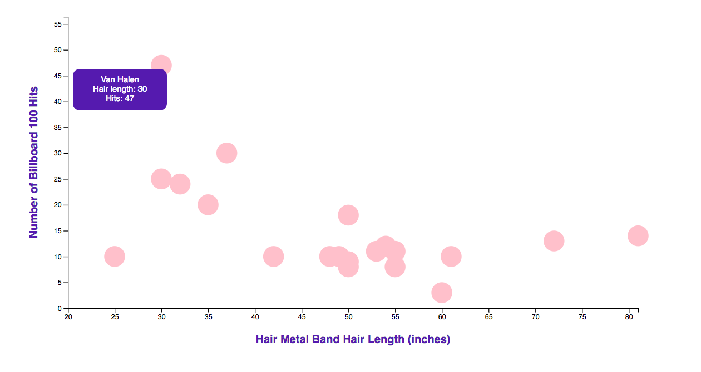

# 1980s Hair Metal Bands

In this activity, we will plot the hair length of heavy metal bands from the 1980s versus their number of Billboard hits. The numbers in the dataset are made up. The bands themselves are very real.

## Instructions

* Write code to complete the chart:

  1. Create scaling functions.

  2. Create axes functions and append them to the chart.

  3. Place data-bound circles on the chart.

  4. Add tooltips using the d3-tips library and tweak the CSS properties to your liking.

* Here is what the finished version might look like:
   

## Hints

* See the [d3-tips documentation](https://github.com/Caged/d3-tip) for reference on using the library.

* Although the code for labeling your x and y axis is provided, you can read a detailed explanation at the [d3noob Website - Adding Axis Labels to D3.js Graph](http://www.d3noob.org/2012/12/adding-axis-labels-to-d3js-graph.html).
