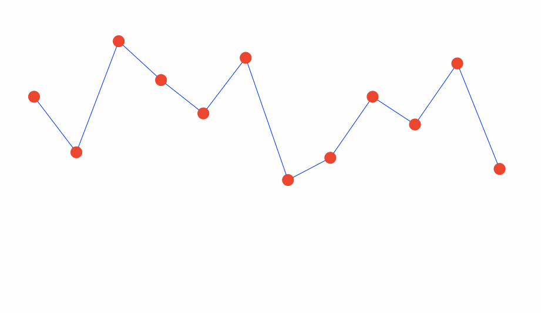
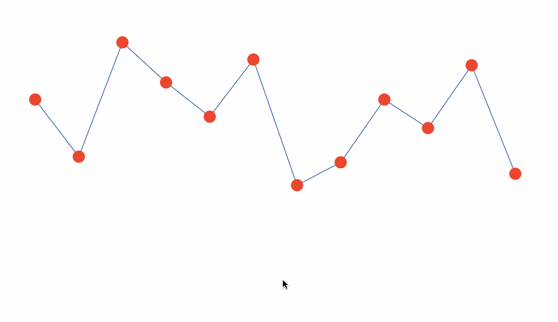

# Transitions

In this activity we will utilize transitions to enhance the chart from the previous activity.

## Instructions

* Although not essential, animations can liven up a chart. The D3 library radically simplifies the task of animating elements on a chart.

* Take a few minutes to examine this [example using D3 transitions](https://bl.ocks.org/d3noob/899a0b2490318a96f9ebd40a5a84e4a7)

* There are three elements of animated transitions in D3:

  1. The selection.

  2. The transition method.

  3. Attributes.

* That is, in order to make a transition, we must first select element(s). We then use the `transition()` method to signal that a transition will take place, followed by specifying specific attributes of the transition, such as duration, movements, or color changes.

* Now you will create at least one of the following transitions on the chart:

  

  

## Bonus

* Try adding a second transition to the chart!

## Hints

* See [example using D3 transitions](https://bl.ocks.org/d3noob/899a0b2490318a96f9ebd40a5a84e4a7)

* The first transition involves changing the original position of the circles so that they are off screen, and then transitioning them down to their proper locations after the rest of the chart is created.

* The code for the second transition should be added to the `mouseout`, `click` and `mouseover`.

* See the [D3 Docs on Transitions](https://github.com/d3/d3/blob/master/API.md#transitions-d3-transition) for reference.
