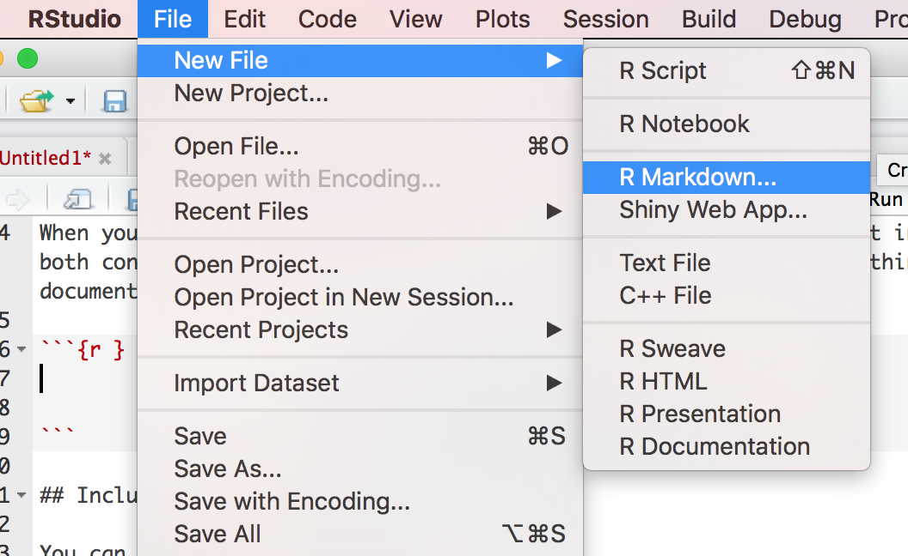
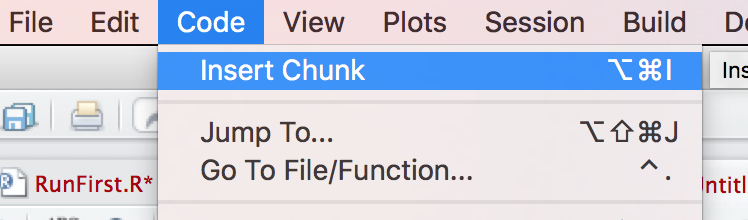
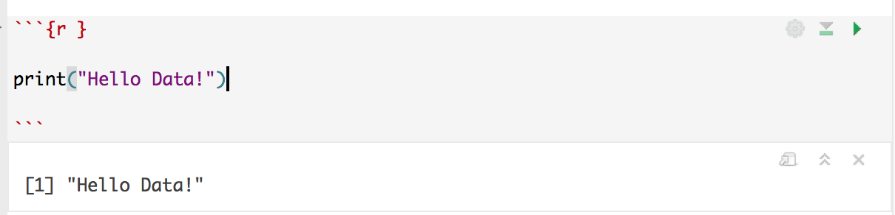

# Basics of Using R Markdown (Rmd)

## Introduction

* R Markdown, like Jupyter Notebook, enables programmers to write and run discrete blocks, or chunks, of code. Additionally, it offers the ability to format the output into reports in HTML, PDF, or in Word documents. 

## Instructions

* In order to create a new Rmd file, go to `File` -> `New File` -> `R Markdown`

  

* To create a new chunk of code, go to `Code` -> `Insert Chunk`. Alternatively, we can use a keyboard shortcut `Ctrl+Alt+I` in Windows, or `Cmd+Opt+I` in Macs.

  

* Write your R code inside the pair of triple backtick marks. At a minimum, your code chunk should start with triple backtick marks and `{r}`, and also end with triple backtick marks:

  ````R
          ```{r}
          YOUR CODE HERE
          ```
  ````

    

* To run a chunk of code, click on the green play button on the upper right corner of a chunk. Alternatively, a keyboard shortcut is `Ctrl+Shift+Enter` in Windows, or `Cmd+Shift+Enter` in Macs. To run only a single line of code, press `Ctrl+Enter` or `Cmd+Enter`. 
