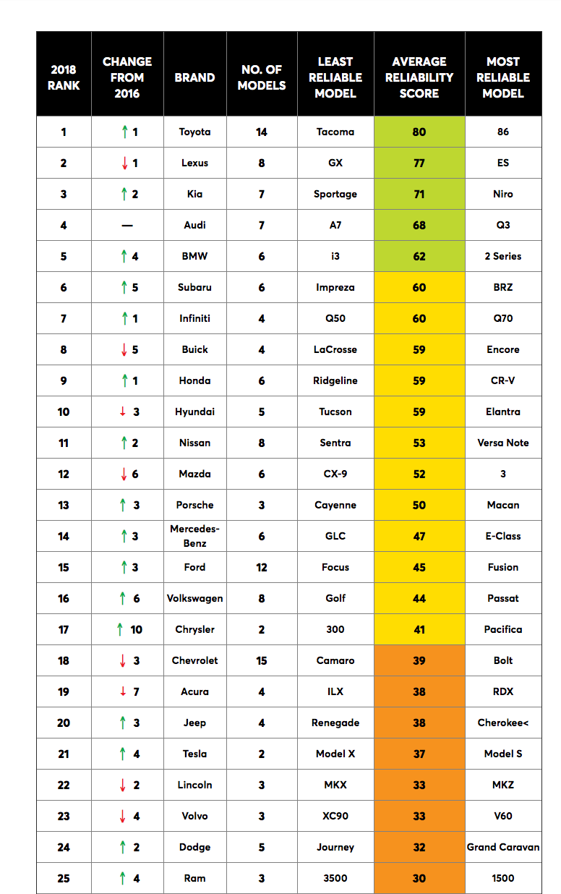

# Tibbles and Tibbles

## Instructions

* In this activity, you will create two Tibbles, the first by adding column by column; and the second by adding row by row.

### Part I: Creating a Tibble by Columns

* Use the `tibble()` function to create a small Tibble of four children, whose names are:

  * George, 12
  * Martha, 11
  * John, 10
  * Abigail, 7

* George, Martha, John, and Abigail are students at a one-room schoolhouse in Massachusetts. They must wait until they are 25 years old to be able to rent horse-drawn carts under their own name.

* Create a Tibble with each child's name, age, and years left until they may legally rent horse carts.

### Part II: Creating a Tibble by Rows

* Create a Tibble, using `frame_data()` function, based on the table below.

  

* Create five rows. Each row in your Tibble should contain Brand, Least Reliable Model, and Average Reliability Score.

### Part III: Bonus

* In the first Tibble, add a row of Thomas, aged 15. You will need to research how to add a row to a Tibble.

* In the second Tibble, add a column of Rank. You will need to research how to add a column to a Tibble.
