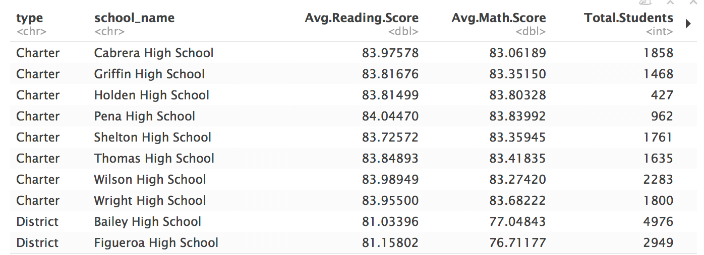
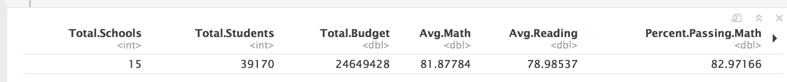
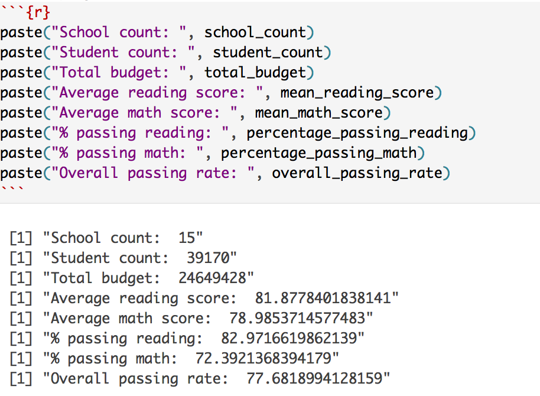

# School Tibble

## Instructions

* In this activity, we return again to the PySchools homework assignment, this time in R.

### Part I

* Create a Tibble: it will be a summary of statistics for each school:

  

### Part II

* If time allows, create a Tibble that is a district-wide summary of schools:

  

* Most of the calculations have already been performed for you in the Rmd file. Your task is to assemble a new Tibble with this information.

  

### Hints

* How to perform a left join in R: <https://stackoverflow.com/questions/37235759/how-to-do-left-join-in-r>  

* How to convert data types:

<https://stackoverflow.com/questions/2288485/how-to-convert-a-data-frame-column-to-numeric-type>  
