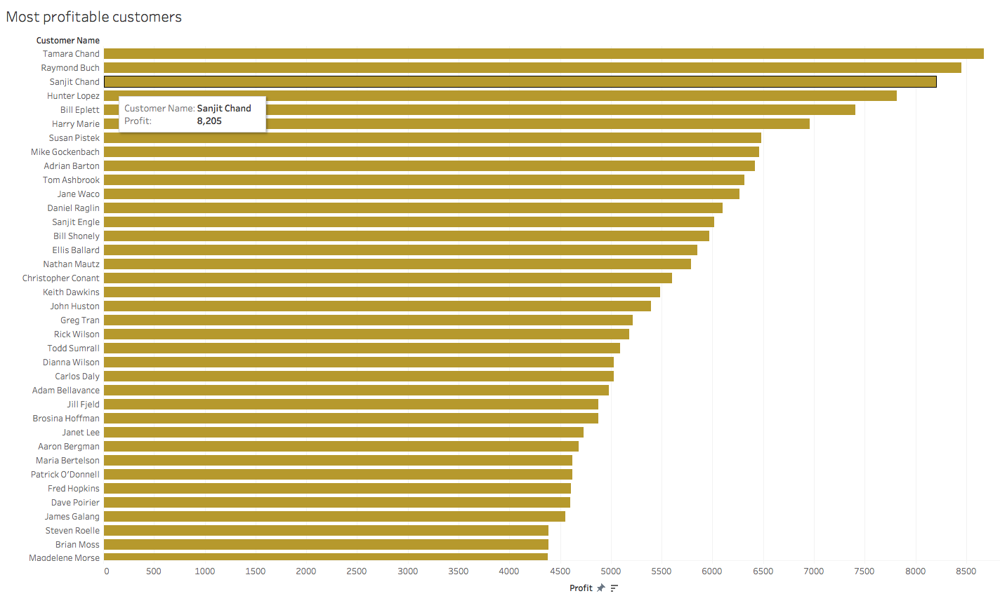

# Data Exploration with Tableau

## Instructions

* Using the `GlobalSuperstoreOrders2016.xlsx` workbook, visualize the following:

1. The customers with the highest sales amount
   
2. The most profitable customers
   
3. The states with the highest average profit
   
4. A monthly timeline of sales
   
5. Profit by region and product category (in the United States).
   
