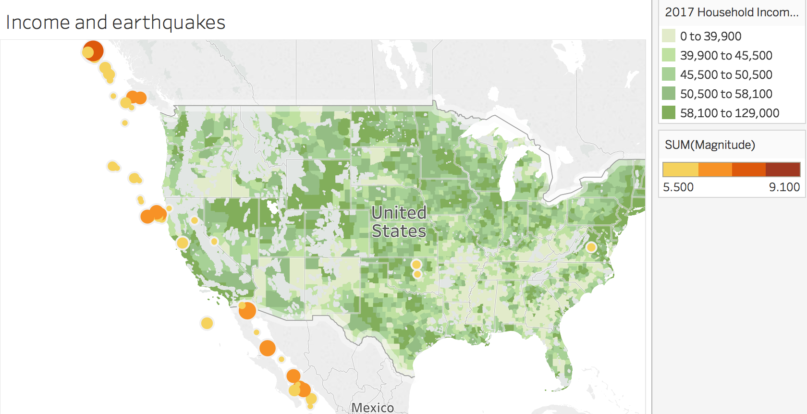

# Earthquake Map

## Instructions

### Part I

* Use `earthquakes_database.csv` to plot the magnitude of earthquakes measured from 1965 to 2016.

  * Earthquakes should be stratified by magnitude, using the `size` and `color` marks. 
  * Use Tableau's built-in census data to determine whether any relationship exists between earthquakes and 2017 median household income, by county.
    

### Part II

* In a separate worksheet, determine whether there has been any trend in the magnitude of earthquakes measured globally over the years. 

### Part III

* Create a global map of earthquakes, with each earthquake's magnitude reflected on the map by size and color. Remember that the Richter scale is logarithmic. How might you reflect this relationship on the map?

### Bonus

* Try to see what other interesting visualizations you can come up with! Feel free to Slack your visualizations to the class.
