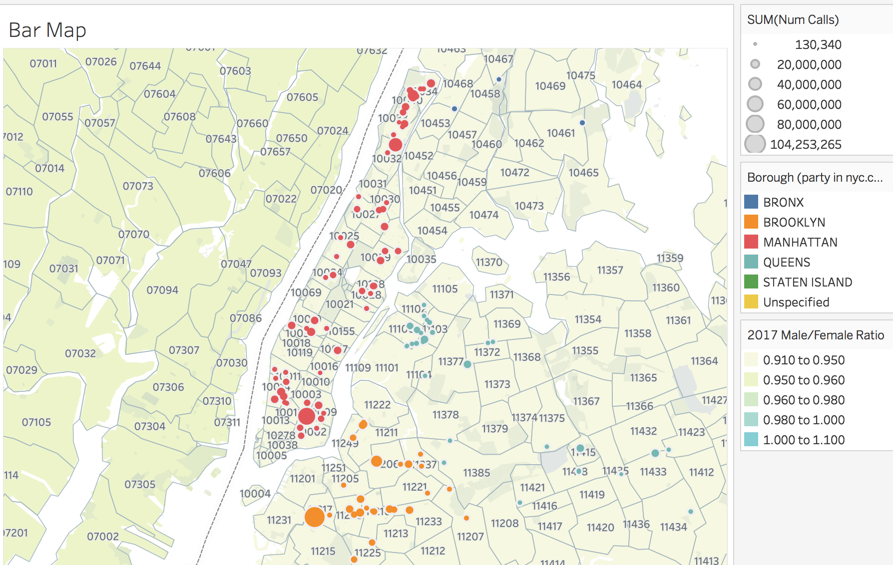
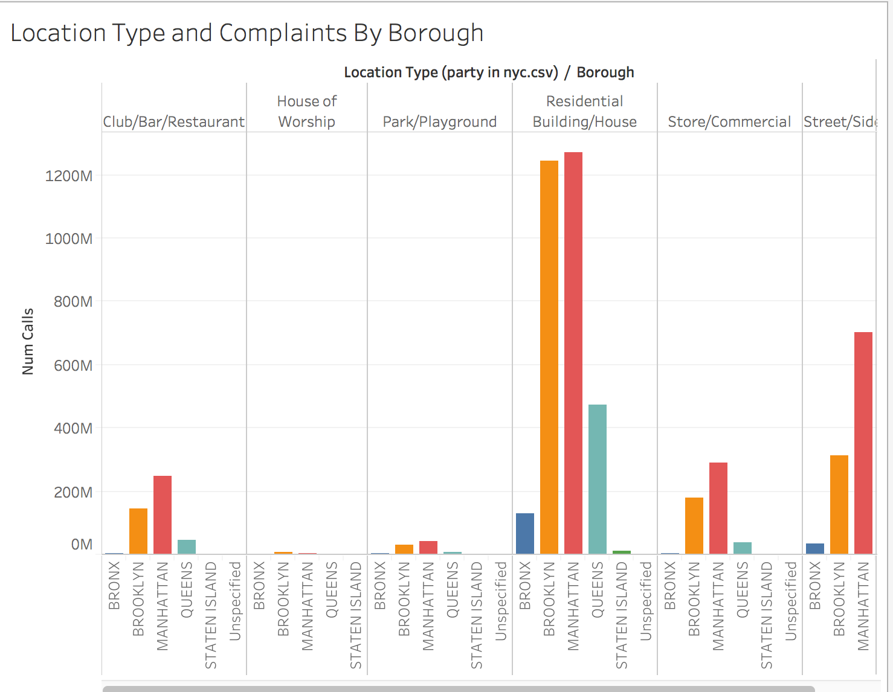

# Most Fun Neighborhood in NYC?

* Your company has asked you to relocate to New York City in your role as the company data wizard, and you are looking for a new apartment. It is important to know which parts of the city are bustling with partiers, whether you're a fun-lover looking for party action, or a lover of peace and quiet looking to avoid rowdy scalawags. Find the most fun neighborhoods in New York City by mapping bars that have received the largest number of noise complaints.

## Instructions

### Part I

* Use the dataset provided to create a map of NYC bars, broken down by boroughs. 

  * It should show the locations of bars that have been subject to noise complaints. 
  * A bar should be proportionately represented by the number of complaints it has received. 
  * A bar should also reflect the borough it is located in.
  * Each zip code in the city should be displayed on the map. Location is everything!

  

### Part II

* Create a bar chart that breaks down, per borough, the type of building versus the number of complaints received.

  

### Part III

* Create a dashboard of the worksheets you created above. If you finish early, feel free to create additional interesting visualizations!

## Resources

* You can explore NYC Open Data for interesting data sets, including noise complaints.

  <https://data.cityofnewyork.us/Social-Services/311-Noise-Complaints/p5f6-bkga/data>
