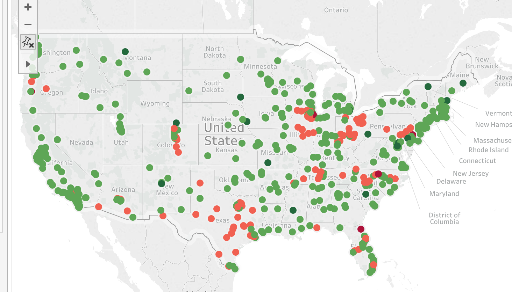
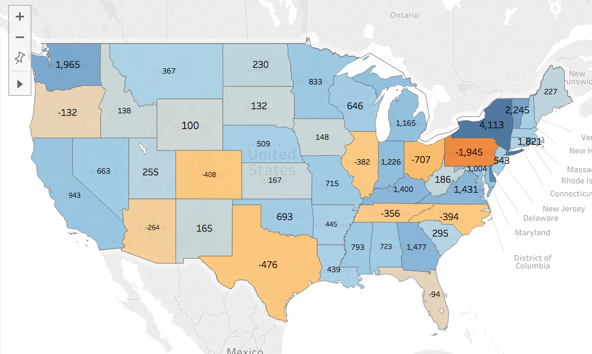

# Level of Detail

## Instructions

### Part I

* With the `Global Superstore` Excel workbook, create a visualization of state-level profits like the below. It visualizes the contribution of each state to the national profit.

  

### Part II

* In the next map, visualize each city's contribution toward the state's total profit.

  

### Part III

* Create a visualization of state-level profits like the below.

  

* The label for each state is **not** the total sum of profits in that state. Rather, it is a state-level visualization of the average of the orders.

* Hint: for this map, you will need to research Tableau LOD syntax. What will you use instead of `EXCLUDE`?
