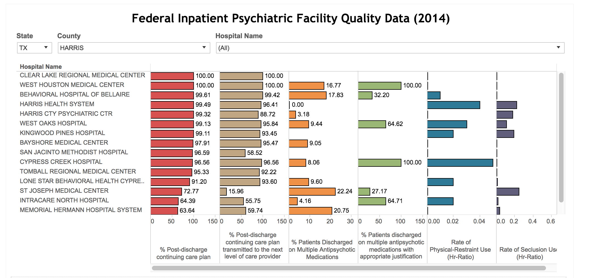

# Psychiatric Health Care

## Instructions

* In this activity, you will work with 2014 data on in-patient psychiatric patient care in hospitals across the United States.

* The data set contains information on, among other things:

  * The number of patients who were discharged with a continuing care plan
  * The number of patients who were discharged with multiple anti-psychotic medications
  * The use of physical restraint
  * The use of seclusion

* You will first have to clean the data, at a minimum fixing the column headings. They will use the included **HBIPS_Measure_Sets.pdf** to accomplish this task.

  * For example, `HBIPS3` in the CSV refers to the use of seclusion, in hours.

* You should first come up with a dashboard summary that resembles the following.

  

* Afterwards, create additional visualizations of your choosing. Focus on data exploration, rather than obtaining pre-defined visualizations. You are encouraged to come up with interesting and creative visualizations, and you are free to bring additional data sources into the workbook.
