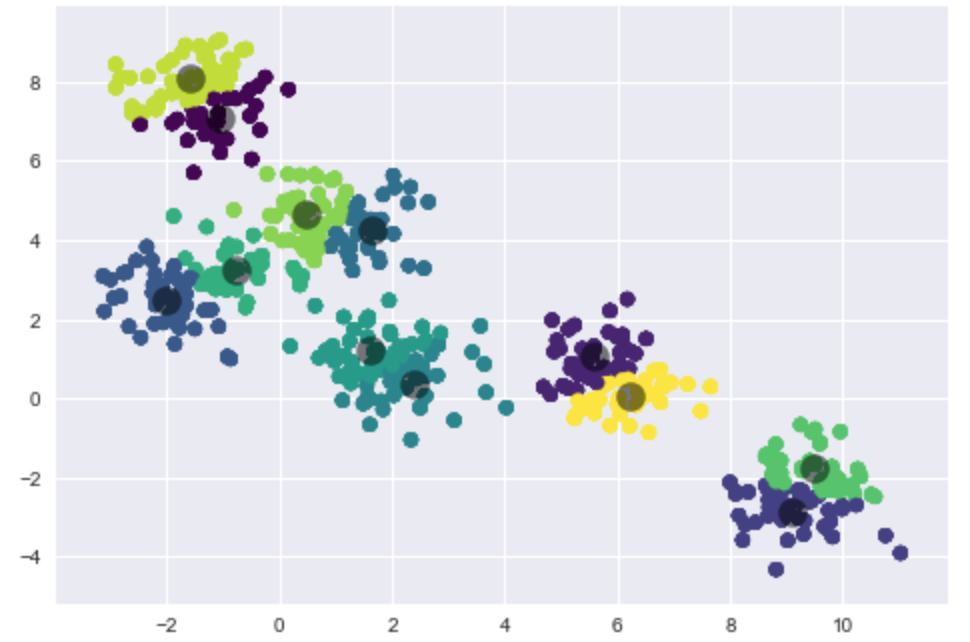

# Kmeans

## Instructions

* Use the starter code to fit a kmeans model to a dataset.

* Visualize the results by creating a plot that looks like the following.

  

## Bonus

* Look up how to get the centers of the Kmeans clusters and plot them!
