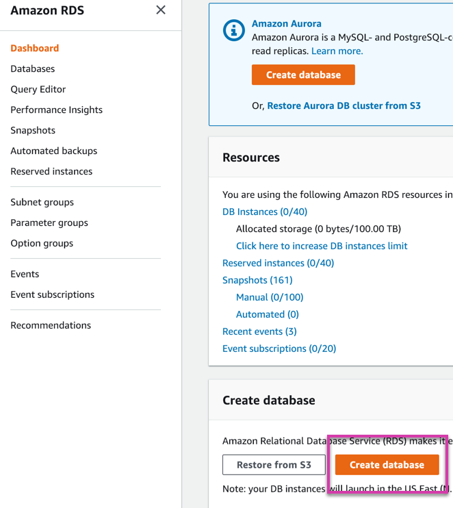
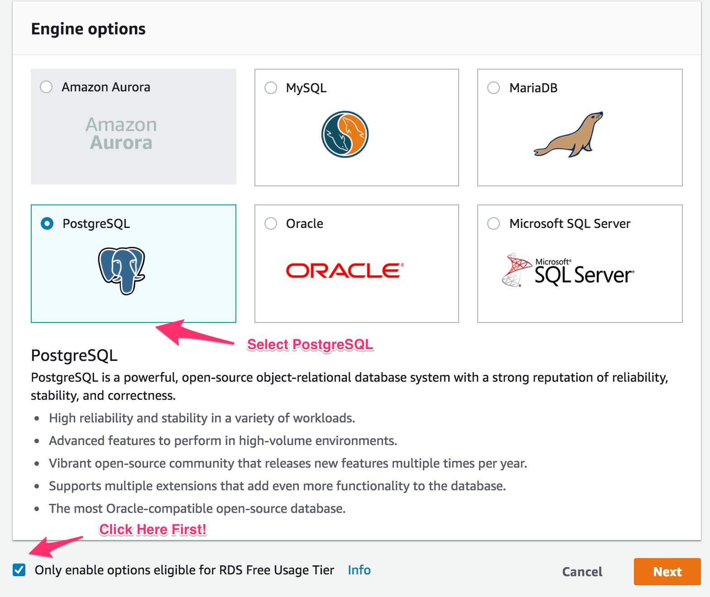
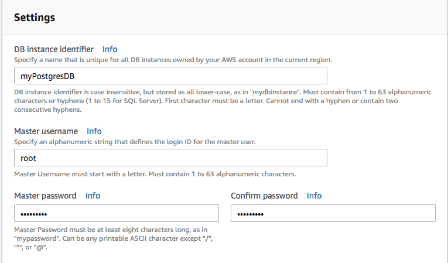
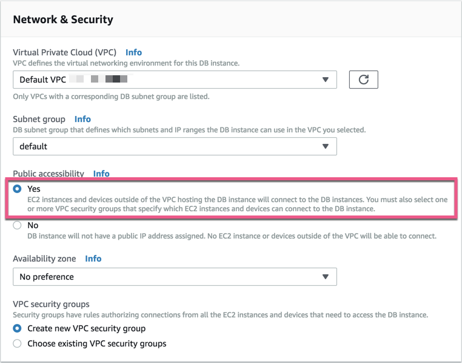
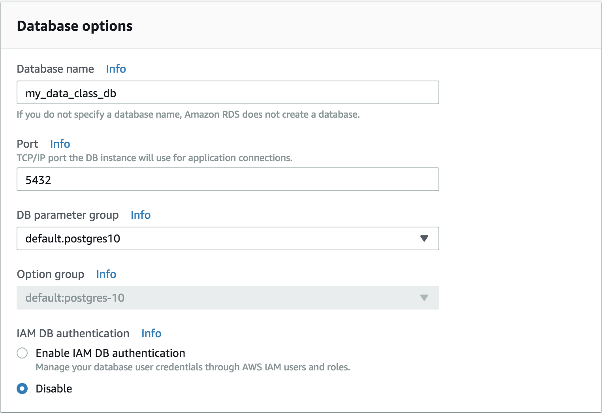

# Creating a PostgreSQL Database in AWS RDS

* Log in to the AWS Management Console and navigate to the RDS section under **All services** find **Database**, then select **RDS**.

  

* Click **Create database** from the **Create database** section to the right. This button will take you to the **Engine options** page, which brings up a menu of different relational databases. 

* **Note:** AWS may have a different screen than the one pictured below. If this is the first time using the service, the orange **Create database** will still be on the right.

  

  **Note:** There may be an option to create a database with Amazon Aurora, which is a paid database. We will not be using this in today's lesson.

* **IMPORTANT:** Check the box next to **Only enable options eligible for RDS Free Usage Tier** at the bottom of the menu.

* Select **PostgreSQL** and click **Next**.

  

* Keep the default settings for the instance specifications.

* Fill out the fields under Settings. Use **myPostgresDB** as the database instance identifier and **root** as the master username.

  * While you can name the database instance identifier and master username anything you like, we recommend sticking to these settings during today's lesson for consistency.

* Enter a password and be sure to record it somewhere. You will need your password to connect to your database from pgAdmin. Your other RDS settings will be accessible in the future, but the password will not. Click **Next** to continue.

  

* Under **Network & Security** select **Yes** under the **Public accessibility** option.

  * This allows connections from outside sources like pgAdmin. A password will still be required.

  

* Under **Database Options**, make the database name **my_data_class_db**.

  * Again, you can name the database anything you like, but during today's lesson, use this name for the sake of consistency. Feel free to use any name when creating RDS databases in the future. Keep the default settings in all other fields.

  

* Click **Create Database** followed by **View DB Instance details** to navigate to the instance console page. AWS will take up to 15 minutes to create a database (but probably less time than that).

* You have now created a PostgreSQL database on AWS's RDS cloud platform!
