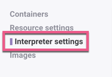

# RDS to ZEPL

* Open ZEPL and walk through the following steps to create a connection to the RDS instance established earlier.

* Click the **Resources** link on the top right of the homepage.

  

* From thew new page click **Interpreter settings** on the left hand side.

  

* Then click the **New interpreter** button on the right.

  

* Select **jdbc** as the Interpreter type.

  

* Give it an alias of **data_class_postgres**.

* Select **postgresql** from the drop-down menu under JDBC driver.

* Add the connection URL. The JDBC URL is in the format `jdbc:postgresql://<instance endpoint>:<port>/<db name>`. 

  * The port number is 5432.

  * The DB name is **my_data_class_db**. This is the name of the datatabase you created earlier in AWS's RDS.

  * Your endpoint will be unique.

* Enter the username and password for **root** that was created during the initial AWS setup.

  

* Click **Test the connection**. If everything is set up correctly, the test will pass and you will see the word "Connected."

    

* Click **Apply**.

* Once a connection has been made, navigate back to the main page and create a new notebook.

  * Under **Notebook Name**, enter **rds_notebook**.

  * Use the default Simple Workload as the resource type.

  * Select **data_class_postgres** as the default interpreter.

  * Click **Submit**.

  

* The notebook will now open automatically and is connected to the AWS RDS instance. Run `SELECT * FROM active_user;` to query the `active_user` table that was created earlier.

* RDS tables can be also be stored in PySpark DataFrames.
