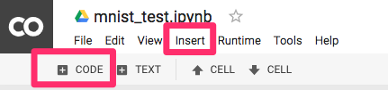

# Machine Learning on Google Colab

## Introduction

* Google Colab hosts Jupyter notebooks in the cloud. To make machine learning easier, TensorFlow and a number of other modules are pre-installed on Colab.

  

* Other conveniences offered by Colab include easy importing of local Jupyter notebooks both from local drives and from Github repositories.

## Instructions

### Creating a Notebook

* In order to use Colab, you will need a Google account. While logged in, go to [https://colab.research.google.com](https://colab.research.google.com).

* To create a new Jupyter notebook, click on `NEW PYTHON3 NOTEBOOK`:

  

  * The notebook will be saved to your Google Drive.

  * Like any other file on Google Drive, you can control the sharing, editing, and collaboration of your notebook.

* Now you are ready to start using Colab:

  

### Using a Colab Notebook

* Colab comes pre-installed with many modules necessary for machine learning, including TensorFlow:

  

  * Like Jupyter notebook, a cell can be run by pressing `SHIFT` + `ENTER` on the keyboard.

* Other modules, such as Flask, will not be installed.

  

* To install a module, run `!pip install`

  

* To upload a file, use the `google.colab` module's `upload()` method:

  

  * Click on `Choose Files` to select local files to upload to Google Drive.

* As in Jupyter notebook, command line interface (CLI) commands are available:

  

* If your notebook times out, click on the highlighted area to reconnect. It should then indicate that it's connected:

  

* To insert a new cell of code in the notebook, click either `+CODE` or `Insert` in the menu:

  

### Additional Information

* Code snippets provide useful boilerplate code for a number of tasks, such as building a plot:

  

* For particularly large datasets, or intensive tasks, Colab offers free hardware acceleration. To enable it, go to `Edit` and select `Notebook settings`, then choose `GPU` as the Hardware Accelerator.

  

  

* To import a local Jupyter notebook into Colab, go to [https://colab.research.google.com](https://colab.research.google.com) and select `UPLOAD`:

  

  * Likewise, Jupyter notebooks can also be imported from Github repositories.
